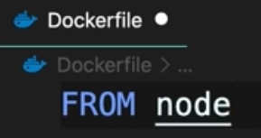

# Docker - tutorial

[Vidéo source](https://youtu.be/pTFZFxd4hOI)

[Document original créé avec Notion](https://splendid-spruce-087.notion.site/Docker-tutorial-34c3b139ae384b87826af772518dc563)

## C’est quoi ?

Plateforme pour construire, faire tourner et envoyer des applications.

Si une appli fonctionne sur une machine spécifique, elle pourra fonctionner identiquement sur d’autres machines.


Si quelqu’un doit reprendre ton projet, il n’a pas besoins de réinstaller un environnement adéquat pour faire fonctionner l’application sur sa machine. Il demande juste à docker d’importer votre application et il importe et exécute tout dans un environnement isolé appelé un “container”.


Permet à plusieurs applications de tourner sur différentes versions de softwares en parallèle sur la même machine. On peut supprimer l’application et ces dépendances en 1 étape.

## Différence entre VM et Conteneurs (Container)

- **Machines Virtuels**
    
    
    
    ### Bénéfices
    
    
    
    ### Problèmes
    
    
    
- **Containers**
    
    
    

## Architecture

- **Architecture client serveur**
    
    
    
- **Processus**
    
    Un container est un processus qui partage le le Kernel (noyau) du système d’exploitation.
    
    
    
    - Un container Linux peut tourner sur Linux et Windows 10 (car Windows 10 à maintenant aussi un noyau Linux (WSL)).
    - Un container Windows ne peut tourner que sur Windows.
    - Mac ne permet pas de faire tourner des container. Ils fonctionnent grâce à une VM Linux.
    

## Installation - Windows

[https://docs.docker.com/get-docker/](https://docs.docker.com/get-docker/)

- **Il est important de lire les prérequis système et de vérifier la compatibilité avec votre machine.**
    
    [https://docs.docker.com/desktop/install/windows-install/#system-requirements](https://docs.docker.com/desktop/install/windows-install/#system-requirements)
    
    - **NE PAS OUBLIER**
        1. Installer WSL 2 : [https://docs.microsoft.com/en-us/windows/wsl/install](https://docs.microsoft.com/en-us/windows/wsl/install)
        2. Activer Hyper-v et conteneurs
        
        
        

## Rendre une application exécutable avec docker

Il suffit d’ajouter une fichier docker à notre application. Cela va permettre à Docker d’emballer l’application dans une image (to package the application into an image).


## Image Docker

Contient tout ce dont une application à besoin pour être exécutée avec Docker.


### Fonctionnement

On dit à Docker de démarrer un conteneur en utilisant l’image spécifiée.

Un conteneur est un processus “spéciale”, car il a son propre système de fichiers fourni par l’image.

### En résumé

Notre application est chargée à l’intérieur d’un conteneur (processus). Et c’est ainsi que l’on peut démarrer une application sur sa machine locale.

Au lieu de directement lancer notre application et la démarrer à l’intérieur d’un processus typique, ont dit à Docker de l’exécuter à l’intérieur d’un conteneur (un environnement isolé).

## Docker Hub


1. Avec notre image, il est possible de la push vers un Docker storage (ex. Docker hub).
2. Docker hub est pour Docker la même chose que Git hub pour Git.
3. C’est un entrepôt pour images Docker que tout le monde peut utiliser.
4. L’image sur la machine test/prod est exactement la même que sur la machine dev, qui contient une version spécifique de notre application avec tout ce dont il a besoin.
5. On dit juste à Docker de démarrer un conteneur en utilisant cette image.
6. Tous les processus d’installation long et fastidieux de l’image d’une application ne sont plus un problèmes car ils sont gérer par le fichier Docker. Avec cela on peut emballer notre application dans une image et l’exécuter virtuellement n’importe où.

## Création d’une image Docker

### **É**tapes

1. Créer un dossier hello-docker et ouvrez le dans vscode.


1. Créer un fichier app.js avec la commande suivante :


1. Inutile d’installer node mais à titre indicatif, si node est installé sur votre machine vous pouvez exécuter votre script pour le tester.


### Sans Docker


1. Démarrer avec un OS
2. Installer Node
3. Copier les fichiers de l’application (ici le app.js uniquement)
4. Exécuter la commande app.js

Pour démarrer la même application (app.js) sur différentes machines il vous faudrait effectuer ces étapes. Cela peut vite devenir compliqué selon sa propre configuration hardware et le nombre de fichiers à configurer/installer/exécuter…

### Avec Docker

Si désiré, vous pouvez d’ores et déjà installer l’extension recommandée par vscode pour les fichiers Dockerfile.


1. Créer un fichier “Dockerfile” (la nomenclature est importante et il n’y a pas d’extension de fichier).


1. On démarre l’application à partir d’une image de base (comme l’héritage en programmation).
    - On peut démarrer à partir une image Linux et installer node après par dessus **OU** on peut directement démarrer à partir d’une image node (cette image est déjà build sur Linux).
    
    
    
    
    

Ces images sont officiellement publiée sur Docker hub.


*Rappel : Docker hub est un registre pour des images Docker.*

Il existe plusieurs images node sur Docker hub. Elles sont toutes build sur des distributions différentes de Linux.

1. Spécifier la distribution de l’image de base (ici alpine). Alpine est une très petite distribution Linux donc la taille de l’image sera réduite d’autant. SI vous prenez une distribution plus courante et  lourde, il en sera de même pour votre image.
    
    
    
2. Copier les fichiers souhaités (ici tous les fichier du répertoire en cours sont spécifiés par le “.”) dans le dossier souhaité (ici “app”).
*Rappel : une image possède sont propre système de fichiers c.à.d que le dossier indiqué y sera créé et vous y retrouverez votre projet.*
    
    
    
3. Utiliser l’instruction “CMD” pour exécuter une commande (ici la commande “node /app/app.js” comme vu avant).
    
    
    
4. Plus simplement on peut spécifier le chemin du dossier en cours avec l’instruction “WORKDIR”
    
    
    
    ### Packaging (Emballage)
    
    
    
    - La commande docker build permet de construire une image Docker depuis un fichier Dockerfile et un contexte (un set de fichiers contenu dans l’url spécifié).
    - Le paramètre -t signifie “tag” il nous permet de donner un tag par lequel notre image pourra être identifiée (ici hello-docker).
    - Le contexte/url spécifié ici est “.” ce qui signifie le dossier actuel (dans lequel vous exécuter la commande).
    
    L’image n’est pas sauvegardée dans votre dossier actuel et une image est plus qu’un seul fichier. Mais nous on veut savoir quels images sont présente sur notre machine :
    
    ```jsx
    C:> docker images
    C:> docker image ls
    ```
    
    
    
    latest à été ajouté par défaut par Docker. Le tag permet de versionner nos images. Chaque image peut contenir une version différentes de notre application.
    
    ### Exécution
    
    Maintenant n’importe quel machine où docker est exécuté et qui possède cette image peut exécuter notre application depuis n’importe où. Vous pouvez publier votre image sur Docker hub pour que tout le monde puisse y accéder (si nécessaire).
    
    
    
     
    
    ### Truc fun
    
    GO TO
    
    [Play with Docker](https://labs.play-with-docker.com/)
    
    Pull un projet
    
    
    
    Tester
    
    
    
    Exécuter
    
    
    
    Docker peut faire tout ça si ça vous intéresse —> [https://www.google.com/](https://www.google.com/)
    
    
    

## 2-3 trucs cool

vous voulez une nouvelle VM :

```jsx
C:> docker run ubuntu
C:> docker run -it ubuntu
```

Faire tourner docker à l’intérieur de docker ?

`docker run --privileged -d docker:dind`
